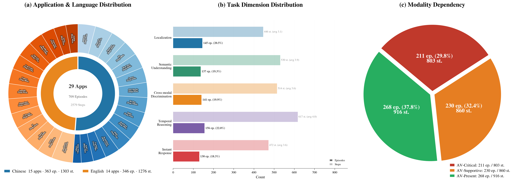
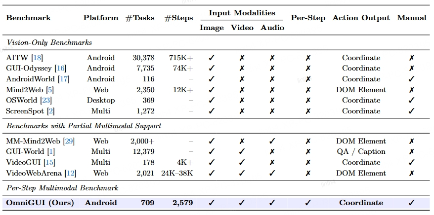
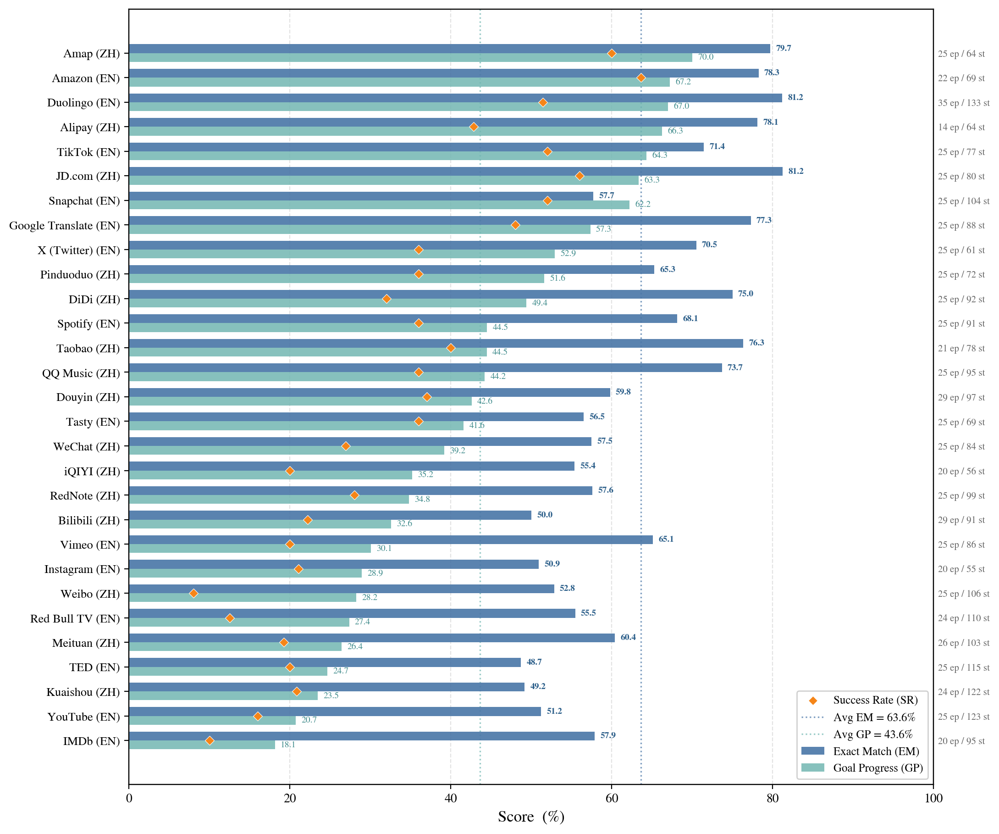

<h1 align="center">OmniGUI: Benchmarking GUI Agents in Omni-Modal Smartphone Environments.</h1>

<p align="center">
  <strong>A step-level benchmark for evaluating GUI agents with interleaved screenshots, audio, video, and action history in smartphone environments.</strong>
</p>

<p align="center">
  <a href="https://omni-gui.github.io/">Project Page</a> |
  <a href="https://github.com/omni-gui/OmniGUI/blob/main/docs/OmniGUI.pdf">Tech Report</a> |
  <a href="https://huggingface.co/datasets/OmniGUI/OmniGUI">Hugging Face Dataset</a> |
  <a href="https://omni-gui.github.io/#leaderboard">Leaderboard</a> |
  <a href="https://github.com/omni-gui/OmniGUI">Code</a>
</p>

<p align="center">
  
</p>

OmniGUI is a step-level GUI agent benchmark designed for omni-modal smartphone interaction. At each action step, the agent receives interleaved multimodal observations, including static screenshots, synchronous audio cues, short video clips, and action history, and must predict the next GUI action such as `TAP` or `TYPE`.

The benchmark contains 709 expert-demonstrated episodes and 2,579 action steps across 29 real smartphone applications in both Chinese and English. OmniGUI evaluates five core capabilities of GUI agents: Localization, Semantic Understanding, Cross-modal Discrimination, Temporal Reasoning, and Instant Response.

## Highlights

- Step-level evaluation with multimodal observations at every action step instead of screenshot-only evaluation.
- Omni-modal smartphone setting with image, audio, video, and action history.
- 709 episodes and 2,579 action steps covering 29 applications across Chinese and English ecosystems.
- Five task dimensions: Localization, Semantic Understanding, Cross-modal Discrimination, Temporal Reasoning, and Instant Response.
- Explicit modality dependency annotations, including AV-Critical, AV-Supportive, and AV-Present settings.

## Leaderboard

Overall results from the latest OmniGUI project-page leaderboard. `TM` = Type Match, `EM` = Exact Match, `SR` = Success Rate, and `GP` = Goal Progress.

| Rank | Model              |       TM |       EM |       SR |       GP |
| ---- | ------------------ | -------: | -------: | -------: | -------: |
| 1    | **Gemini 3.1 Pro** | **83.6** | **66.6** | **37.2** | **46.4** |
| 2    | Gemini 3.0 Pro     |     80.7 |     66.4 |     33.1 |     43.3 |
| 3    | Gemini 3.0 Flash   |     78.2 |     63.9 |     30.2 |     43.0 |
| 4    | Gemini 2.5 Pro     |     75.4 |     47.4 |     15.4 |     26.0 |
| 5    | Gemini 2.5 Flash   |     69.1 |     40.7 |     12.5 |     24.2 |
| 6    | Qwen3-Omni         |     62.1 |     33.4 |      5.2 |     17.2 |
| 7    | VITA-1.5           |     40.0 |     13.7 |      1.1 |      2.2 |
| 8    | MiniCPM-o-4.5      |     31.0 |      4.8 |      0.1 |      1.4 |
| 9    | Baichuan-Omni-1.5  |     15.8 |      3.3 |      0.0 |      0.4 |

For the full dimension-wise breakdown, please visit the [project leaderboard](https://omni-gui.github.io/#leaderboard).

## Dataset Overview

| Statistic    | Value             |
| ------------ | ----------------- |
| Applications | 29                |
| Languages    | Chinese + English |
| Episodes     | 709               |
| Action steps | 2,579             |

<p align="center">
  
</p>

<p align="center">
  <em>Application coverage, task-dimension distribution, and multimodal dependency statistics in OmniGUI.</em>
</p>

## Benchmark Comparison

Current GUI-agent benchmarks are still dominated by static screenshot settings. OmniGUI is built to evaluate agents in more realistic smartphone environments where transient audio cues and temporal video dynamics can directly determine the correct next action.

<p align="center">
  
</p>

<p align="center">
  <em>Compared with prior GUI-agent benchmarks, OmniGUI supports image, audio, and video inputs at each decision step.</em>
</p>

## Result Snapshot

<p align="center">
  
</p>

<p align="center">
  <em>Performance of Gemini 3.0 Pro across applications, highlighting substantial variation across real-world mobile apps.</em>
</p>

## Quick Start

### 1. Create the environment

```bash
conda create -n omnigui python=3.10 -y
conda activate omnigui
```

### 2. Install dependencies

```bash
pip install -e ./lmms_eval
```

If you plan to run Gemini-based baselines, also install:

```bash
pip install google-genai
```

### 3. Download the dataset

```bash
huggingface-cli download XIAOCHENLIN00zz/OmniGUI \
  --repo-type dataset \
  --local-dir data
```

After downloading, your local data directory should contain:

```text
data/merged_sorted.json
data/benchmark/
```

### 4. Configure the API endpoints

Copy [`.env.example`](.env.example) to `.env`, then fill in the model endpoints or local paths you need:

```env
GEMINI3_PRO_API_KEY=
GEMINI3_FLASH_API_KEY=
GEMINI25_PRO_API_KEY=
GEMINI25_FLASH_API_KEY=
GEMINI_BASE_URL=

QWEN3_API_KEY=
QWEN3_BASE_URL=

MINICPM_O_API_URL=
BAICHUAN_OMNI_API_URL=

VITA_PRETRAINED=
```

### 5. Run an evaluation script

Launch scripts are provided in [`scripts`](scripts). For example:

```bash
bash scripts/task_v2_qwen3_omni.sh
```

This will run:

```bash
python -m lmms_eval \
  --model qwen3_omni \
  --tasks task_v2_qwen3_omni \
  --batch_size 1 \
  --log_samples \
  --output_path logs/task_v2_qwen3_omni
```

Results and logs are written to:

```text
logs/<task_name>/
```

## Experiment Suites

- Main benchmark runs: full multimodal evaluation scripts are provided as `scripts/task_v2_*.sh`.
- Modality ablations: `scripts/task_abl*_*.sh` remove audio, remove video, or remove both to isolate modality contribution.
- TTS instruction setting: `scripts/task_tts_*.sh` replace the original text instruction with TTS-generated audio.

Task configs are located in [`lmms_eval/tasks/agentcpm_gui`](lmms_eval/tasks/agentcpm_gui).


## Citation
Feel free to cite the following article if you find OmniGUIhelpful:
```latex
@misc{Felix26guiomni,
    title = {OmniGUI: Benchmarking GUI Agents in Omni-Modal Smartphone Environments},
    url = {https://github.com/omni-gui/OmniGUI/},
    author = {Felix Henry, Xiaochen Lin, Jiangyou Zhu, Yangfan, Bingqian Zhang, Min Chen, and Shiyu Huang},
    month = {March},
    year = {2026}
}
```